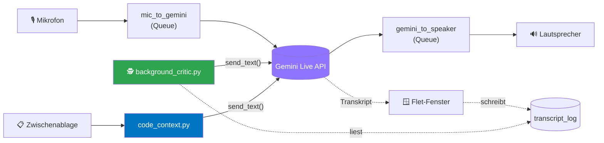

<div align="center">

# 🎙️ CodeWhisper

### Sprachgesteuerter Entwicklungs-Assistent

Du sprichst — die KI antwortet per Stimme, in Echtzeit, mit zwei Denkrollen und einem stillen Kritiker im Hintergrund.

[](https://www.python.org/)
[](https://ai.google.dev/gemini-api/docs/live)
[](https://flet.dev/)
[](#der-plan-in-4-phasen)
[](#tests-ausführen)
[](#)

</div>

---

## ✨ Was es kann

| | |
|---|---|
| 🗣️ **Live-Sprachgespräch** | Reden statt tippen — Gemini Live API antwortet per Stimme, fast ohne Wartezeit |
| 🎭 **Duo-Mode** | Eine KI, zwei Denkrollen: **Visionär** (Chancen, groß denken) ↔ **Pragmatiker** (Realismus, Kosten, Risiken) |
| 🕵️ **Closed-Loop-Kritiker** | Läuft still im Hintergrund mit, findet Logikfehler/Widersprüche und flüstert sie der KI unauffällig zu |
| 📋 **Code-Kontext-Grounding** | Ein Klick schickt den Inhalt der Zwischenablage unsichtbar mit — die KI redet über echten Code statt nur über deine Beschreibung davon |
| 💾 **Sitzungen** | Gesprächsverlauf speichern & wieder öffnen, als JSON unter `sessions/` |
| 🎨 **Frei einstellbar** | ~30 Gemini-Stimmen zur Auswahl, alles per Zahnrad-Symbol im Fenster |

---

## 🚀 Schnellstart

**1. Voraussetzungen**

- **Python 3.10+** — Windows: [python.org](https://www.python.org/), beim Installer **„Add python.exe to PATH"** anhaken · Linux: `sudo apt install python3 python3-venv portaudio19-dev`
- **Gemini-API-Key** — kostenlos auf [Google AI Studio](https://aistudio.google.com/apikey)

**2. Einrichten**

```bash
# Windows
python -m venv .venv
.venv\Scripts\activate
pip install -r requirements.txt

# Linux
python3 -m venv .venv
source .venv/bin/activate
pip install -r requirements.txt
```

Dann `config.example.json` kopieren → `config.json`, deinen `api_key` eintragen.

**3. Starten**

```bash
python main.py
```

Fenster geht auf → Punkt wird grün („Verbunden") → einfach reden.

---

## 🧠 Wie es unter der Haube läuft



Mic-Thread und Speaker-Thread laufen unabhängig vom Event-Loop (echte Audio-Threads, per `asyncio.Queue`/Lock angebunden). Der Hintergrund-Kritiker und das Code-Kontext-Grounding sind reine Seitenkanäle: Beide reden nur über `GeminiLiveSession.send_text()` unsichtbar in die laufende Sitzung hinein — sie fassen den Audio-Pfad nie direkt an.

---

## 📁 Die Dateien im Überblick

| Datei | Zweck |
|---|---|
| `main.py` | Startpunkt: Fenster (Flet) + verbindet alles |
| `audio_engine.py` | Mikro rein, Lautsprecher raus |
| `gemini_session.py` | Verbindung zur KI, sendet Hördaten, empfängt Antworten |
| `config.py` | Liest/schreibt `config.json` |
| `config.json` | Deine Einstellungen (API-Key, Stimme, Modell, Duo-Mode, Hintergrund-Prüfer) — **nicht** im Repo, siehe `config.example.json` |
| `sessions.py` | Gesprächsverlauf speichern/laden (Ordner `sessions/`) |
| `duo_mode.py` | Phase 3: Regeln für die zwei Denkrollen |
| `background_critic.py` | Phase 4: der stille Kritiker (Closed-Loop) |
| `code_context.py` | Code-Kontext-Grounding: Zwischenablage → unsichtbare Kontext-Nachricht |
| `tests/` | 47 Pytest-Tests für die Logik-Module |

---

## ⚙️ Einstellungen in `config.json`

| Feld | Bedeutung |
|---|---|
| `api_key` | dein Gemini-Key (Pflicht) |
| `voice` | Stimme der KI (z. B. `Aoede`, `Charon`, `Kore`, `Puck`, `Fenrir`) — auch über das Zahnrad-Symbol änderbar |
| `model` | welches Gemini-Modell (voreingestellt passt) |
| `system_instruction` | die „Persönlichkeit" der KI |
| `duo_mode` | `"off"` \| `"auto"` (Rollenwechsel nach jeder Antwort) \| `"manual"` (per Knopf im Fenster) |
| `critic_enabled` | `true`/`false` — schaltet den Hintergrund-Prüfer an/aus |
| `critic_model` | welches (nicht-live) Gemini-Textmodell der Prüfer benutzt |
| `critic_check_every` | nach wie vielen eigenen Gesprächsbeiträgen der Prüfer nachschaut |

---

## 🧪 Tests ausführen

```bash
pytest
```

Testet die Logik-Module (`config.py`, `sessions.py`, `duo_mode.py`, `background_critic.py`, `code_context.py`) ohne echtes Mikro/Lautsprecher/API — Gemini-Aufrufe werden durch Fakes ersetzt, die Zwischenablage durch eine injizierbare Funktion. `main.py` selbst (die Flet-Oberfläche) hat keine automatisierten Tests — per Hand prüfen (`python main.py` starten und ausprobieren).

---

## 🩹 Troubleshooting

| Symptom | Ursache |
|---|---|
| „Kein API-Key gefunden" | `config.json` fehlt oder Key nicht eingetragen |
| Fehler beim Start unter Linux wegen Audio | `sudo apt install portaudio19-dev` nachinstallieren |
| Kein Ton / kein Mikro | Standard-Audiogerät in Windows/Linux prüfen — das Programm nimmt jeweils das Standardgerät |
| Fenster bleibt leer / Fehler „403" | meist ungültiger oder abgelaufener API-Key |

---

## 🎯 Das Projekt in einem Satz

Eine App, mit der du per Sprache mit einer KI über deine Geschäftsideen oder deinen Code sprichst — sie antwortet sofort per Stimme, spielt dabei zwei Denkrollen, kennt bei Bedarf den echten Code aus deiner Zwischenablage, und meldet sich von selbst, wenn sie einen Fehler in deiner Logik findet.

---

## 🏛️ Die 4 Grundsatzentscheidungen

1. **Duo-Mode:** Eine KI, die beide Rollen selbst wechselt, statt zwei getrennter Persönlichkeiten hin- und herzuschalten. Grund: `system_instruction` legt die Persönlichkeit beim Verbindungsaufbau fest und lässt sich nicht live neu setzen — eine Instruktion zum Selbst-Wechsel bringt das gleiche Ergebnis ohne Pause/Reconnect.
2. **Stimmen:** Eine der ~30 fertigen Gemini-Stimmen statt einer maßgeschneiderten Stimme — Custom-Voice-Synthese würde spürbar Verzögerung ins Gespräch bringen.
3. **Closed-Loop (Hintergrund-Kritik):** Das stärkste Stück am Konzept, kommt aber erst in Phase 4, weil es auf allem anderen aufbaut.
4. **Audio zuerst:** Der schwierigste Teil beim Testen, kein Konzeptfehler — deshalb als Erstes gebaut, damit die meiste Zeit dafür bleibt.

---

## 🗺️ Der Plan in 4 Phasen

<details>
<summary><b>Phase 1 — Sprechen (das Fundament)</b> ✅ umgesetzt</summary>
<br>

- Du sprichst ins Mikrofon, die KI antwortet per Stimme, fast ohne Wartezeit.
- Ein einfaches Fenster mit einem einzigen Knopf: Stumm an/aus.
- **Fertig, wenn:** 10 Minuten am Stück sprechen, ohne dass Ton abbricht oder die App abstürzt.

</details>

<details>
<summary><b>Phase 2 — Komfort</b> ✅ umgesetzt</summary>
<br>

- Textfenster daneben: schriftlich mitlesen, was die KI sagt.
- Sitzungen speichern und wieder öffnen (Knöpfe unten im Fenster; Dateien liegen als JSON in `sessions/`).
- Einstellung für gewählte Stimme (Zahnrad-Symbol oben rechts; wirkt nach Neustart der App).
- **Sprechtempo entfällt:** Die Gemini-Live-API bietet keinen Parameter dafür (nur Stimmen-Auswahl + Sprache) — ein Nachbau per Audio-Resampling würde die Stimme verzerren (Pitch-Shift). Bewusst gestrichen statt notdürftig nachgebaut.

</details>

<details>
<summary><b>Phase 3 — Die zwei Denkrollen</b> ✅ umgesetzt</summary>
<br>

- Eine Anweisung an die KI (`duo_mode.py`): Sie antwortet abwechselnd als **Visionär** (denkt groß, sieht Chancen) und als **Pragmatiker** (prüft auf Realismus, Geld, Aufwand).
- Einstellbar, wie oft gewechselt wird — `"auto"` (nach jeder Antwort, selbstständig) oder `"manual"` (nur per „Rolle wechseln"-Knopf, über eine unsichtbare Textnachricht via `send_text()`).
- Kein Verbindungswechsel nötig (siehe Entscheidung 1) — beide Modi laufen über eine einzige, angereicherte `system_instruction`.

</details>

<details>
<summary><b>Phase 4 — Der stille Kritiker (Closed-Loop)</b> ✅ umgesetzt</summary>
<br>

- Ein zweiter, unsichtbarer Prozess (`background_critic.py`) liest in Abständen (`critic_check_every`) den Verlauf mit — über einen separaten, nicht-live Text-Aufruf, nicht über die Sprachverbindung.
- Findet er einen Fehler oder Widerspruch, flüstert er der KI unauffällig etwas ins Ohr (`send_text()`) — sie bringt es natürlich ins Gespräch ein.
- Nutzer merkt nichts davon, außer dass die KI plötzlich klügere Einwände macht.
- Aus mit `critic_enabled: false` (Standard) — schaltbar in `config.json`.

</details>

<details>
<summary><b>Bonus — Code-Kontext-Grounding</b> ✅ umgesetzt</summary>
<br>

- Größter identifizierter Hebel für „mehr Wert": bis hierhin kannte die KI nur, was laut gesagt wurde — nie echten Code.
- Ein Knopf im Fenster („Code-Kontext senden") liest die Zwischenablage (`code_context.py`) und schickt sie als unsichtbare Kontext-Nachricht in die laufende Sitzung.
- Lange Ausschnitte werden gekürzt (`max_chars`, Standard 4000 Zeichen), leere/fehlerhafte Zwischenablage wird sauber abgefangen — bricht die Sprach-Sitzung nie.
- Git-Diff-Variante bewusst nicht gebaut: dieses Repo selbst hatte zum Zeitpunkt der Entscheidung kein `.git` — kein ungetesteter Pfad für einen Fall, der nicht vorlag.

</details>

---

## 🙅 Was wir bewusst weglassen

- Eigene künstliche Stimmen (zu langsam)
- Wechsel zwischen zwei getrennten KI-Persönlichkeiten (technisch nicht sauber möglich)
- Alles, was nicht dem Kern dient: keine Anmeldung, keine Cloud, kein Design-Feinschliff
